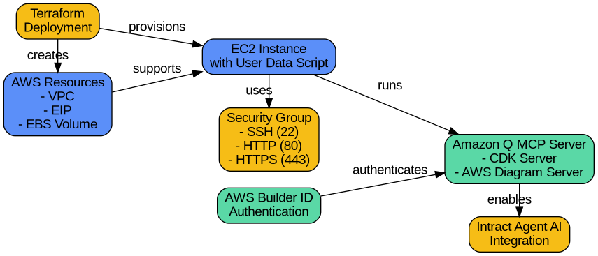

# Amazon Q MCP Server Quick Install (for Intract Agent AI)- terraform 

This project helps you quickly set up an AWS EC2 server with Amazon Q MCP, using Terraform. It is ready for Intract Agent AI or similar tools. You get a working server in minutes.

---





## Features
- Automated EC2 provisioning with secure networking
- Auto-import of SSH keys
- Security group with SSH, HTTP, and HTTPS access
- Encrypted root EBS volume (gp3)
- Custom tags and names
- **Amazon Q MCP server quick install** via user data script
- Example configuration for Intract Agent AI
- Clean, modular Terraform structure


---

## Prerequisites
- AWS CLI configured with appropriate credentials
- Terraform >= 1.3
- SSH key pair (public key in `.pub` format)
- AWS account with permissions to create VPC, EC2, EIP, etc.

---

## Quick Start

1. **Clone the repository**
2. **Edit `terraform.tfvars`** with your values (see example below)
3. **Run Terraform**:

```bash
terraform init
terraform plan
terraform apply
```

4. **Access your instance** using the output public IP or DNS.

---

## Example `terraform.tfvars`
```hcl
ami_id            = "ami-0e35ddab05955cf57"
instance_type     = "t2.micro"
public_key_path   = "./id_rsa.pub"
volume_size       = 8
availability_zone = "ap-south-1a"
instance_name     = "my-ec2"
key_name          = "id_rsa.pub"
project           = "devops"
tags = {
  Environment = "personal"
  Owner       = "Shubham"
  Project     = "MultiPurposeEC2"
}
```

---

## Variables
- `ami_id` (string, **required**): AMI ID for the EC2 instance
- `instance_type` (string, default: `t2.medium`): EC2 instance type
- `instance_name` (string, **required**): Name tag for the instance
- `key_name` (string, **required**): SSH key pair name
- `public_key_path` (string, **required**): Path to your public key file
- `volume_size` (number, default: 8): Root EBS volume size (GB)
- `tags` (map, default provided): Resource tags
- `project` (string, **required**): Project/environment name
- `availability_zone` (string, **required**): AWS AZ (e.g., `ap-south-1a`)

---

## Outputs
- `instance_id`: EC2 instance ID
- `public_ip`: Public IP address
- `public_dns`: Public DNS
- `elastic_ip`: Elastic IP attached to the instance

---

## Amazon Q MCP Server Quick Install

The EC2 instance is provisioned with a user data script (`amazon_q_mcp.sh`) that:
- Installs dependencies (`libfuse2`, `astral-uv`)
- Downloads and installs Amazon Q
- Sets up configuration for MCP servers (CDK and AWS Diagram)
- **Ready for Intract Agent AI or similar frameworks**

**Manual Step:** After instance creation, SSH in and run:
```bash
q login
```
This authenticates Amazon Q with your AWS Builder ID.

---

## Security & Best Practices
- Never commit your private keys
- Use IAM roles and least-privilege policies
- Destroy resources when not in use: `terraform destroy`

---

## License
MIT or as specified by the project owner.

---

## Credits
- [Amazon Q](https://aws.amazon.com/q/)
- [Terraform by HashiCorp](https://www.terraform.io/)
- Intract Agent AI (contextual usage)